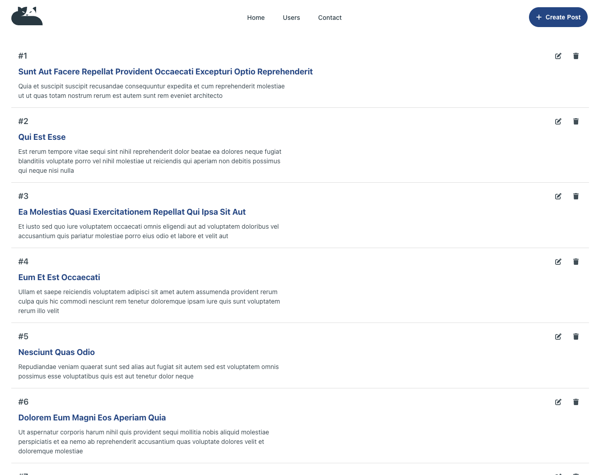

# Post Board

A React + TypeScript + Vite application for displaying and managing posts.

## Tech Stack

- React 19
- TypeScript
- Vite
- React Router
- JSONPlaceholder API (typicode)

## Getting Started

1. Clone the repository:

   ```
   git clone [your-repo-url]
   cd post-board
   ```

2. Install dependencies:

   ```
   npm install
   ```

3. Run the development server:

   ```
   npm run dev
   ```

4. Open your browser and navigate to:
   ```
   http://localhost:5173
   ```

## Build for Production

```
npm run build
```

## Notes

- The `.env` file is included in this repository for your testing convenience since it only contains the public JSONPlaceholder API URL.
- This project uses [JSONPlaceholder](https://jsonplaceholder.typicode.com/) as a fake REST API for development and testing.

## Data Persistence

Posts are stored in React Context. Any modifications or new posts will be lost when the page is reloaded.
